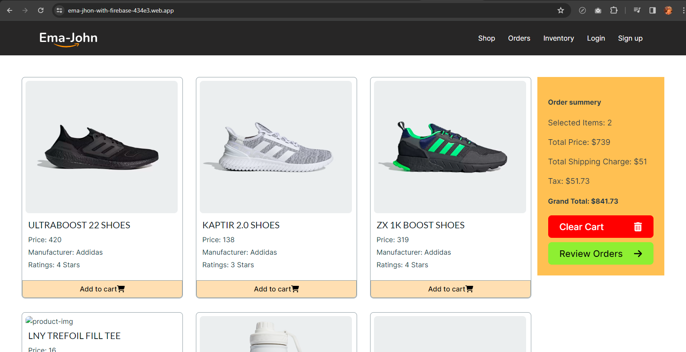

# Ema-John



This project is crated with npm vite+react. This is an e-commerce project. This projects data is coming from a node.js server server side code is [here](https://github.com/nurullah91/ema-john-server) and live server is [here](https://ema-john-server-green.vercel.app/)

## Installation
To run this project locally clone this code and command this on your terminal

```
npm install
```
```
npm run dev
```

### Live link: https://ema-jhon-with-firebase-434e3.web.app